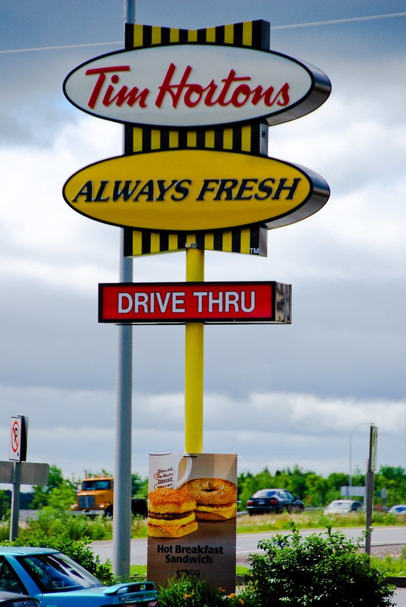

# DIGH 3814: Week 1 Coursework
## Tutorial: Markdown

My **favourite** piece of academic writing thus far in my university career would be a piece I wrote for *SOCI 1001*, Introduction to Sociology. This piece directed students to pick a community they were apart of and use sociological principles discussed in class to analyze it. At the time, I was working at Tim Hortons and so I chose to review how the employees and customers each contributed to the community in different ways. For example, I explained that in order for the restaurant to run smoothly, each employee must complete the tasks assigned to them. This aligned with Emile Durkheim's principle of [social solidarity](http://routledgesoc.com/category/profile-tags/social-solidarity) which observes each social institution as a body in which its functioning is dependent on the actions of each independent organ. In my essay, Tim Hortons was a body and each employee was an organ. I consider this essay to be my favourite piece of academic writing because although students were instructed to use course material, it still gave writers leeway in what they could write about. This was different from any other essay I have written at Carleton and I enjoyed taking a break from writing about assigned readings or other academic and scholarly content.

## Tutorial: Github
1. I created an account on Github.com under the name meganmacrae.
2. After establishing my account, I created my first repository and called it "Week-One" as well as checked the box that said "initialize this repository with a README".
3. I proceeded to watch the video tutorials on how to create and upload files to Github.
4. I then clicked the "add file" box and chose the "upload files" option.
5. I dragged my "DIGH 3814" file folder option into Github.com which then uploded my log.md, reflection.md and photo files.
6. An issue occurred with my log where the photos were not coming up properly on the rendered version, why is this?
7. Realized that I put round brackets around the name of the photo instead of square brackets.
8. Once I fixed the brackets, the rendered version of the log.md looked correct.

## Tutorial: Anaconda
1. Started by downloading the Anaconda appliction for macOS.
2. Where do I open the terminal? Don't see an applications option where I can search for it.
3. The 'terminal' option is found under the 'Environments' tab on the left side of the page.
4. Once in the 'Environments' section, click on the arrow next to 'base roots' and choose the 'Open Terminal' option.
5. Once the terminal has been opended, start by typing "conda --version" and "conda. 4. 9. 2" will come up.
6. Then, type "python --version" and "Python. 3. 8. 5" will come up.
7. Note: If you do not leave a space between conda/python and the "--", an error will arise when you enter the data.
8. I continued following the listed instructions by entering "pwd" in the terminal in order to print the working directory.
9. What came up after inputting "pwd" was the username I login to on my laptop.
10. The next instruction directed me to input "Ls" in the terminal and this brought up the available folders in my systen (ex. Downloads, Documents, Pictures etc.)
11. I followed the next instruction which was to input "cd subfolder" into the terminal to change directories.
12. The first directory I changed to was my Documents my inputting "cd Documents" into the terminal and as excpected, a list of my documents came up.
13. I followed the pattern by again, inputting "Ls" into the terminal and then typing "cd Downloads" which brought up a list of my downloads.
14. I learned at this point that prior to changing directories, you must type "Ls" everytime (before you type "cd subfolder").
